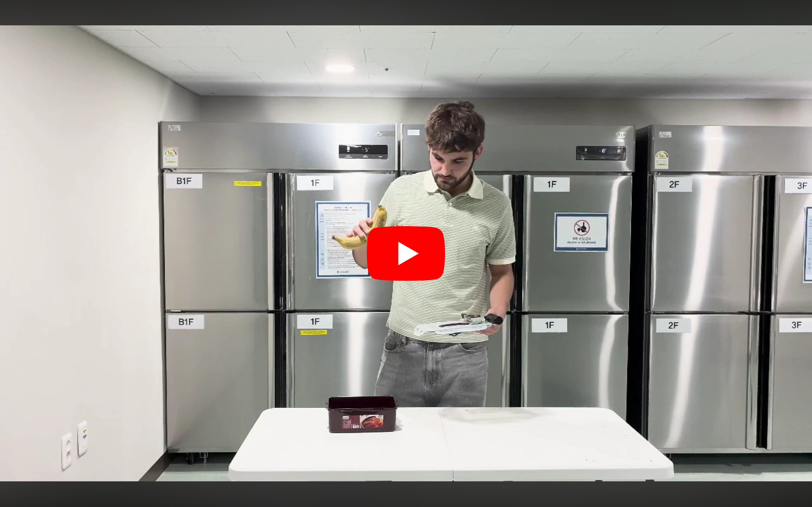
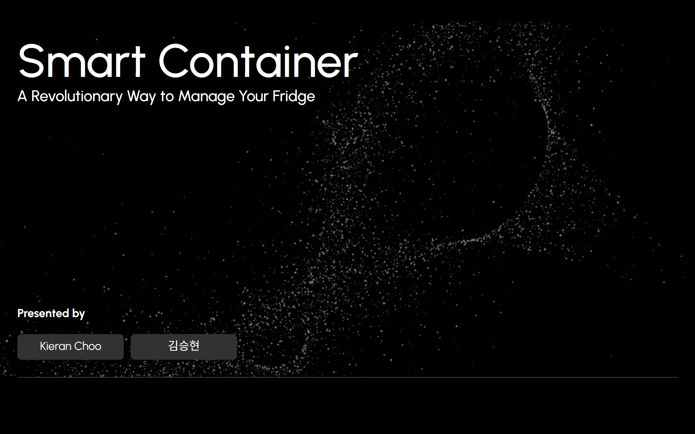

# SWE-G13
**Smart Fridge Connected Smart Container**

## Group Members

| Name | Organization | Email |
|------|-------------|--------|
| Kieran Choo | School of Electrical and Electronic Engineering, Nanyang Technological University | KCHOO012@e.ntu.edu.sg |
| Cyriaque Denniel | ECE Paris École d'Ingénieurs, School of Engineering | cyriaque.denniel@edu.ece.fr |
| Le Mee Thomas | ECE Paris École d'Ingénieurs, School of Engineering | thomas.lemee@edu.ece.fr |
| Kim Seung Hyun | Department of Information Systems, Hanyang University | skim21@hanyang.ac.kr |

## Project Proposal
>
>This electronic “Smart Container” aims to provide a convenient way to allow users to track and maintain the freshness of the container’s contents within a smart fridge. 
>
>With the use of a combination of a LAN connection and a built in timer, the Smart Container intends to connect to the Smart Fridge and provide real time information of the duration the contents within have been present for. 
>
>By constantly communicating with the Smart Fridge through a seamless connection, the Smart Container will relay time and location information of the container, informing the user via Built-in lights and a Notification alert sent to the >user’s preferred device of the duration the container has been in the fridge for and whether the container has been outside the fridge for a set duration of time. 
>
>By informing the user of this information, we aim to minimize food spoilage and potential food waste from accumulating within the fridge of the user. 

## Demonstration Video

## Presentation

## System Architecture Diagram

## About this project
The Smart Container is a container that can track and relay data to your mobile devices via a dedicated app. The container provides tracking data such as how long the shelf-life of the food inside has left, whether it is inside the fridge or not, and the status of each container.

### Extra Links
Korean Blog: [Korean Blog Post](https://tinyurl.com/Smart-Container)
Presentation: [Smart Container Presentation]([https://docs.google.com/presentation/d/1l5lxsdPG4x3cCg-uU6voLHMnuX4MshKKnc80DY1riLQ/edit?usp=sharing](https://docs.google.com/presentation/d/e/2PACX-1vTogg4b_viOuCwuHHPn6Fd-4azFJXvhYg2lpks5XA-9pGGFuAPpDH0Ro2rFCoNaS5p6iSteUG3otoTe/pub?start=false&loop=false&delayms=3000)) 
AI Blog: [AI Blog](https://rumbling-cosmos-f4d.notion.site/Food-Analysis-AI-Driven-Food-Type-and-Expiration-Date-Analyzer-2940fee9bdbe8028967bf1f23860c2e1)
